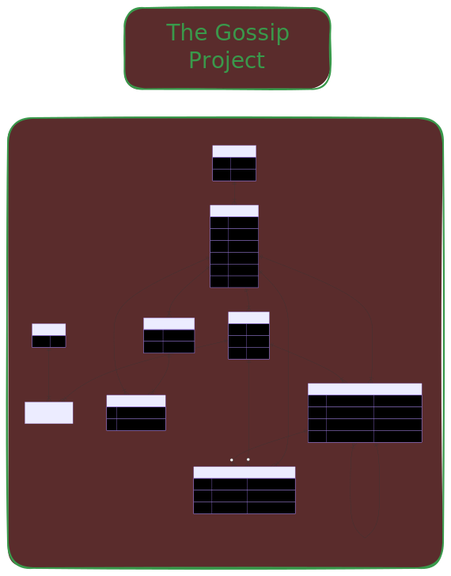

# The Gossip Project (Rails Edition)

[](https://github.com/ff14eternitalis-debug/the-gossip-project/actions/workflows/ci.yml) [](https://github.com/ff14eternitalis-debug/the-gossip-project/actions/workflows/dependabot/dependabot-updates)    

Welcome to **The Gossip Project**, a full-stack Rails application created as part of **The Hacking Project (THP)** bootcamp.
The goal of this project is to master **ActiveRecord**, complex database relationships (1-N, N-N, and polymorphic associations), **controllers**, **views** and **Bootstrap** by building a social network where users post gossips, tag them, comment (including comment-on-comment), like, and send private messages.

## Features

- **Authentication** (Devise): sign up, sign in, sign out. Navbar shows different links when logged in (Mon compte, Déconnexion) or out (Connexion, Inscription).
- **Home page** (`/`): all gossips in Bootstrap cards with author, comment count, like count, tags; link "Nouveau potin" when logged in.
- **Gossip CRUD**: create, read, update, delete gossips. Only the author can edit or delete. Forms use Bootstrap; tags can be selected (multiple) on create/edit.
- **Gossip detail page** (`/gossips/:id`): title, content, author (link to profile), city link, tags, like/unlike button and count; list of comments with author and date; form to add a comment (when logged in); edit/delete comment (author only).
- **City page** (`/cities/:id`): city name, list of gossips from users in that city. Linked from user profile and gossip detail when the author has a city.
- **User profile page** (`/users/:id`): personal info, city (linked if present), list of their gossips.
- **Tags**: select multiple tags when creating or editing a gossip; tags displayed on gossip show and index; page per tag (`/tags/:id`) listing all gossips with that tag.
- **Likes**: like/unlike on gossips and on comments (when logged in); like counts on gossip show and on the home page cards.
- **Team page** (`/team`) and **Contact page** (`/contact`).
- **Personalized welcome page** (`/welcome/:first_name`).
- **Dark theme** with Bootstrap 5.3 native dark mode and responsive navbar.

## Prerequisites

- **Ruby** (version 3.4.2)
- **Rails** (version 8.1.x)
- **Gems**: `devise` (authentication), `faker` (seed data)

## Database Architecture



This project implements a relational schema to manage users, cities, gossips, tags, comments (with comment-on-comment), likes (on gossips or comments), and private messages.

### Entities and Attributes (ERD)

| Table                         | Attributes                                                                                         |
| ----------------------------- | -------------------------------------------------------------------------------------------------- |
| **CITY**                      | `name`, `zip_code` (string)                                                                        |
| **USER**                      | `first_name`, `last_name`, `email` (string), `description` (text), `age` (integer), `city_id` (FK) |
| **GOSSIP**                    | `title` (string), `content` (text), `user_id` (FK)                                                 |
| **TAG**                       | `title` (string)                                                                                   |
| **JOIN_TABLE_GOSSIP_TAG**     | `gossip_id`, `tag_id` (FK)                                                                         |
| **PRIVATE_MESSAGE**           | `content` (text), `sender_id` (FK → users)                                                         |
| **PRIVATE_MESSAGE_RECIPIENT** | `private_message_id`, `recipient_id` (FK → users)                                                  |
| **COMMENT**                   | `content` (text), `user_id` (FK), `commentable_type`, `commentable_id` (polymorphic)               |
| **LIKE**                      | `user_id` (FK), `likeable_type`, `likeable_id` (polymorphic)                                       |

Rails automatically adds `id` (PK) and `created_at` / `updated_at` to each table.

### Relationships (ERD)

- **CITY** → 1-N → USER
- **USER** → 1-N → GOSSIP ; **GOSSIP** → N-1 → USER
- **GOSSIP** ↔ N-N ↔ TAG via JOIN_TABLE_GOSSIP_TAG
- **PRIVATE_MESSAGE** → N-1 → USER (sender) ; **PRIVATE_MESSAGE** ↔ N-N ↔ USER (recipients) via PRIVATE_MESSAGE_RECIPIENT
- **COMMENT** → N-1 → USER ; **COMMENT** → polymorphic → GOSSIP or COMMENT (comment-on-comment)
- **LIKE** → N-1 → USER ; **LIKE** → polymorphic → GOSSIP or COMMENT

### Model Relationships (code)

- **City**: A central hub. Users belong to a City.
- **User**: Has many gossips, comments, and likes. Sends and receives private messages (sender / recipients via `class_name`).
- **Gossip**: Belongs to a user. Has many tags through `JoinTableGossipTag`. Has many comments (as `commentable`) and likes (as `likeable`).
- **Tag**: N-N with Gossip via `JoinTableGossipTag`.
- **PrivateMessage**: Belongs to sender (User). Has many recipients (User) through `PrivateMessageRecipient`.
- **Comment**: Belongs to user and to `commentable` (polymorphic: Gossip or Comment). Has many sub-comments (as `commentable`) and likes (as `likeable`).
- **Like**: Belongs to user and to `likeable` (polymorphic: Gossip or Comment).

## Routes

| Method | URI | Controller#Action | Description |
|--------|-----|-------------------|-------------|
| GET | `/` | `gossips#index` | Home — all gossips (cards with comment/like count, tags) |
| GET | `/gossips` | `gossips#index` | Same as root |
| GET | `/gossips/new` | `gossips#new` | New gossip form (auth required) |
| POST | `/gossips` | `gossips#create` | Create gossip (auth required) |
| GET | `/gossips/:id` | `gossips#show` | Gossip detail (comments, like/unlike, tags) |
| GET | `/gossips/:id/edit` | `gossips#edit` | Edit gossip form (author only) |
| PATCH/PUT | `/gossips/:id` | `gossips#update` | Update gossip (author only) |
| DELETE | `/gossips/:id` | `gossips#destroy` | Delete gossip (author only) |
| POST | `/gossips/:gossip_id/comments` | `comments#create` | Add comment (auth required) |
| GET | `/comments/:id/edit` | `comments#edit` | Edit comment (author only) |
| PATCH | `/comments/:id` | `comments#update` | Update comment (author only) |
| DELETE | `/comments/:id` | `comments#destroy` | Delete comment (author only) |
| GET | `/cities/:id` | `cities#show` | City page — gossips from users in that city |
| GET | `/tags/:id` | `tags#show` | Tag page — gossips with that tag |
| POST | `/likes` | `likes#create` | Like a gossip or comment (auth required) |
| DELETE | `/likes/:id` | `likes#destroy` | Remove like (auth required) |
| GET | `/users/:id` | `users#show` | User profile |
| GET | `/team` | `static_pages#team` | Team presentation |
| GET | `/contact` | `static_pages#contact` | Contact page |
| GET | `/welcome/:first_name` | `static_pages#welcome` | Personalized landing page |

Devise routes: `/users/sign_in`, `/users/sign_up`, `/users/sign_out`, etc.

## Installation

1. **Clone the repository**:

   ```bash
   git clone https://github.com/DevRedious/the-gossip-project.git
   cd the-gossip-project
   ```

2. **Install dependencies**:

   ```bash
   bundle install
   ```

3. **Setup the database**:

   ```bash
   rails db:create
   rails db:migrate
   ```

4. **Seed the database**:

   ```bash
   rails db:seed
   ```

   This will populate your database with 10 cities, 10 users, 20 gossips, 10 tags (each gossip has at least one tag), 15 private messages (with one or more recipients), 20 comments (including comment-on-comment), and 20 likes on gossips or comments, using the Faker gem.

5. **Start the server**:

   ```bash
   rails server
   ```

   Then open `http://localhost:3000` in your browser.

## Usage

### Web Interface

- **Home** (`/`): Browse all gossips (cards show title, author, comment count, like count, tags). Click "Voir plus" for the full gossip. Logged-in users see "Nouveau potin".
- **Gossip detail** (`/gossips/:id`): Full content, author (link to profile), city link, tags, like/unlike and count. Comments list with edit/delete for the author; form to add a comment when logged in. Author sees "Modifier" and "Supprimer" for the gossip.
- **User profile** (`/users/:id`): User info, city (if set), list of their gossips. Reach it by clicking an author name.
- **City** (`/cities/:id`): All gossips from users in that city. Linked from profile and gossip when the author has a city.
- **Tag** (`/tags/:id`): All gossips that have this tag. Tags on gossips are clickable.
- **Team** (`/team`) and **Contact** (`/contact`).
- **Welcome** (`/welcome/YourName`): Personalized welcome message.
- **Auth**: Sign up, sign in, sign out via navbar. Required to create/edit/delete gossips, comment, and like.

### Rails Console

All backend associations can also be tested via the Rails Console:

```bash
rails console
```

```ruby
# User's gossips and city
User.first.gossips
User.first.city

# Gossip's tags (N-N through)
Gossip.first.tags

# PrivateMessage sender and recipients
PrivateMessage.first.sender
PrivateMessage.first.recipients

# Comment-on-comment (polymorphic)
Comment.where(commentable_type: "Comment").first.commentable
Comment.first.comments

# Likes on gossips or comments (polymorphic)
Gossip.first.likes
Comment.first.likes
User.first.likes
```

## Key Concepts Learned

### 1. Advanced ActiveRecord Associations

- **has_many :through**: Used to link Gossips and Tags via `JoinTableGossipTag`, and to link PrivateMessages to multiple recipient Users via `PrivateMessageRecipient`.
- **Polymorphic associations**: Comments can belong to a Gossip or to another Comment (`commentable`). Likes can belong to a Gossip or a Comment (`likeable`). Enables comment-on-comment and like-on-gossip-or-comment without duplicate tables.
- **class_name**: Used on PrivateMessage (sender, recipients) and related User associations to distinguish multiple references to the same model.

### 2. Database Migrations

- Generating tables in dependency order (cities before users, users before gossips, etc.).
- Using `references` with `polymorphic: true` and `foreign_key: { to_table: :users }` for custom foreign keys.

### 3. Data Integrity & Seeding

- Writing a robust `seeds.rb` that respects creation order and uses Faker and `.sample` for realistic, randomized data. Destroying in reverse order to respect foreign keys.

### 4. Controllers & Views

- RESTful controllers: `GossipsController` (full CRUD), `CommentsController` (create nested under gossip, edit/update/destroy shallow), `CitiesController`, `TagsController`, `LikesController` (polymorphic create/destroy), `UsersController` (show). Static pages: `team`, `contact`, `welcome`.
- Devise for authentication: `authenticate_user!` and author checks (`current_user == @gossip.user` or `@comment.user`).
- Nested and shallow routes: `resources :gossips do resources :comments, only: [:create] end` and `resources :comments, only: [:edit, :update, :destroy]`.
- Strong parameters and authorization (only author can edit/delete gossip or comment).
- Helpers: `link_to`, `button_to`, `form_with`, named routes (`gossip_path`, city_path, tag_path, like_path, etc.).

### 5. Bootstrap Integration

- Bootstrap 5.3.3 via CDN with native dark mode (`data-bs-theme="dark"`).
- Responsive navbar with toggler for mobile.
- Card components for gossip display.
- Grid system (`row` / `col-md-*`) for responsive layouts.

## Documentation

- [`docs/DOCUMENTATION.md`](docs/DOCUMENTATION.md) — Documentation technique
- [`docs/DEPLOI_HEROKU_POSTGRESQL.md`](docs/DEPLOI_HEROKU_POSTGRESQL.md) — Mise en ligne Heroku, PostgreSQL, accès réservé aux utilisateurs connectés
- [`CHANGELOG.md`](CHANGELOG.md) — Historique des versions
- [`CONTRIBUTING.md`](CONTRIBUTING.md) — Guide pour contribuer
- [`CONTRIBUTORS.md`](CONTRIBUTORS.md) — Contributeurs du projet

### Icons

Favicon and app icon: [`public/icon.svg`](public/icon.svg) (used in the layout). The PWA manifest references `public/icon.png` (512×512). To generate it from the SVG (e.g. with ImageMagick): `convert -background none -resize 512x512 public/icon.svg public/icon.png`. Without `icon.png`, only the SVG favicon is used; PNG is needed for installable PWA icons.

## Related projects (THP BDD)

- [FreeDoc](https://github.com/ValVoy/THP---FreeDoc-Project) — Doctors, patients, appointments, specialties (N-N associations).
- [DogBnB](https://github.com/ff14eternitalis-debug/dogbnb) — Dog rental (relational model).

## Authors

Projet à visée pédagogique (The Hacking Project). Voir [CONTRIBUTORS.md](CONTRIBUTORS.md) pour la liste des contributeurs.

[Morgan](https://github.com/DevRedious), [Romain](https://github.com/ff14eternitalis-debug)

_The Hacking Project 2026_
